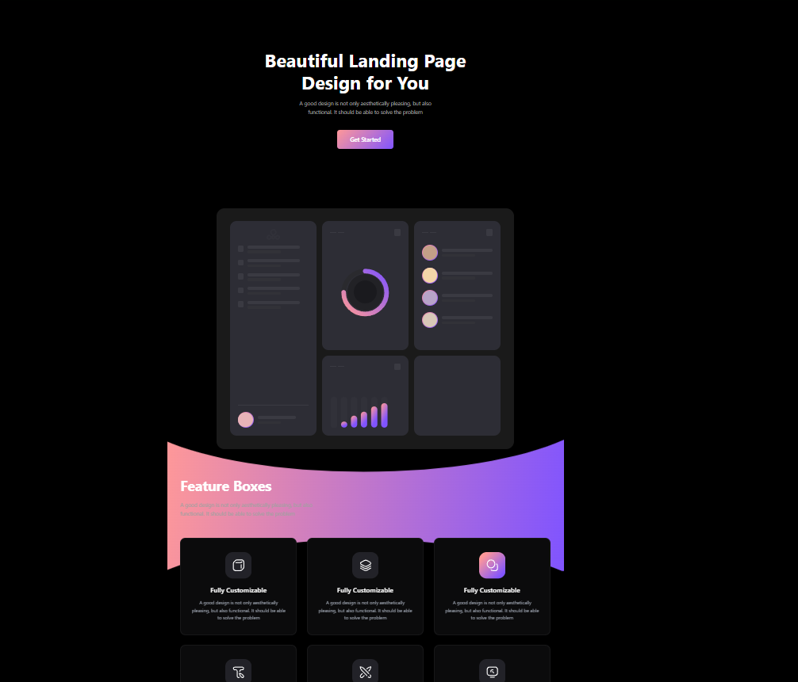
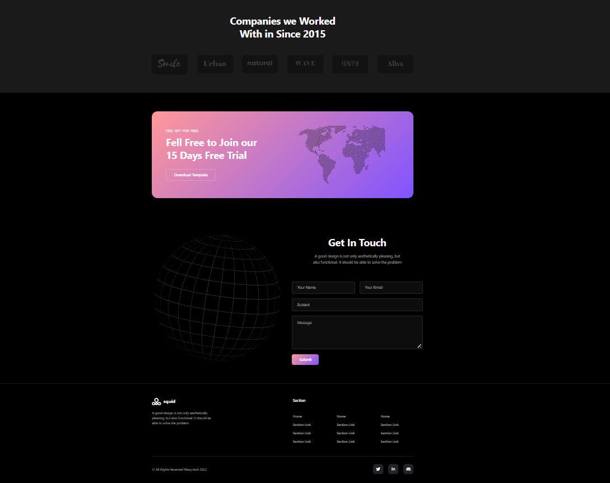
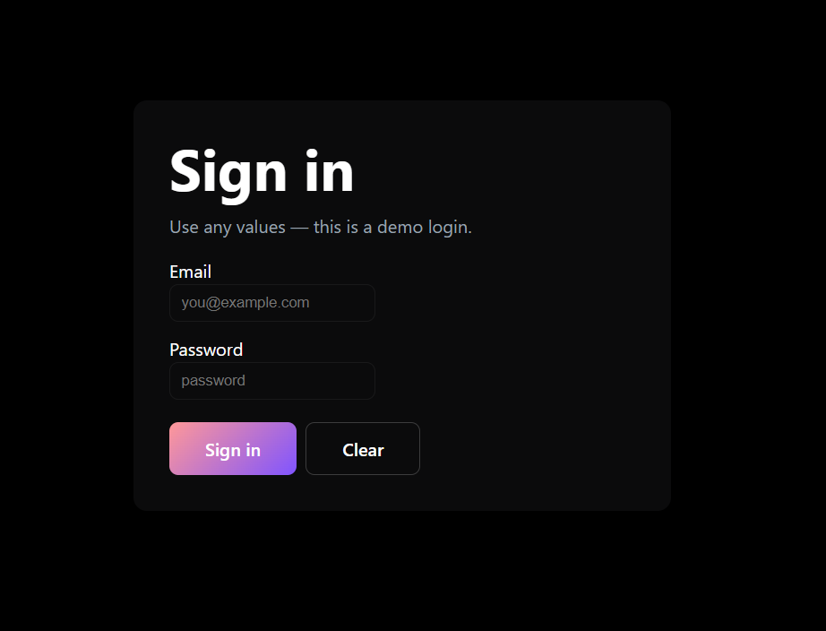
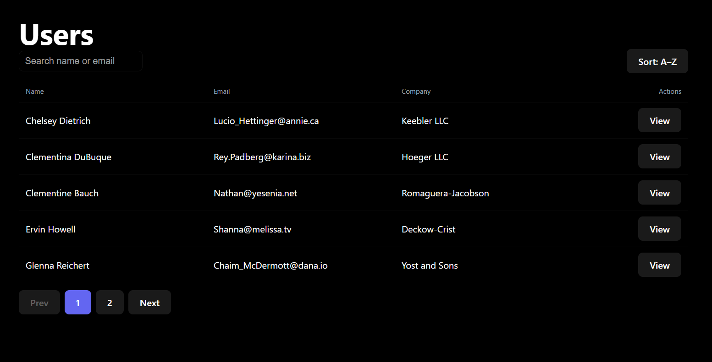
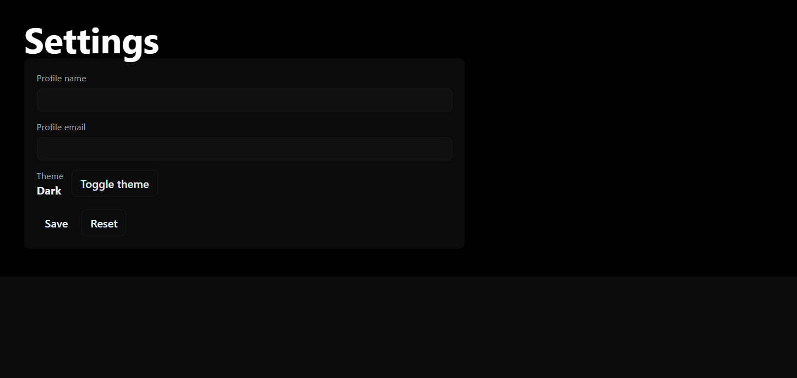

# Homepage — Landing Page

A compact, beginner-friendly React + Vite landing page with animated UI, a demo dashboard, and simple auth flows.

## Setup

### Prerequisites
- Node.js (v16 or higher)
- npm or yarn package manager

### Installation

1. Clone the repository:
```bash
git clone <repository-url>
cd vite-project
```

2. Install dependencies:
```bash
npm install
```

3. Start the development server:
```bash
npm run dev
```

The application will be available at `http://localhost:5173`

### Build for Production

```bash
npm run build
```

### Preview Production Build

```bash
npm run preview
```

## Features Checklist

- ✅ **Feature Cards** - Showcase key features with icons and descriptions
- ✅ **User Authentication** - Login and user management system
- ✅ **Settings Panel** - User preferences and configuration
- ✅ **Contact Form** - Newsletter signup and contact form
- ✅ **CTA Banner** - Call-to-action section with button
- ✅ **Footer** - Navigation and company information
- ✅ **Animated Elements** - Floating icons and smooth transitions
- ✅ **Form Validation** - Input validation for forms
- ✅ **Modal Management** - Reusable modal component
- ✅ **Dark Theme Support** - Modern dark/light mode ready

## Screenshots

(Held in `src/assets` — displayed below)


### Home


### Home


### Sign in


### User


### Settings


## Decisions & Tradeoffs

### Architecture Decisions

1. **Component-Based Structure**
   - **Decision**: Organized components by feature/page rather than by type
   - **Rationale**: Makes it easier to maintain and modify features independently
   - **Tradeoff**: Slightly more duplication in styling, but better code organization

2. **Inline SVG for Animated Icons**
   - **Decision**: Embedded SVG directly in FloatingIcons component
   - **Rationale**: Enables precise control over animations and styling
   - **Tradeoff**: Larger component files, but avoids additional HTTP requests

3. **CSS Modules Over CSS-in-JS**
   - **Decision**: Scoped CSS files paired with components
   - **Rationale**: Better performance and easier debugging
   - **Tradeoff**: Need to import CSS alongside component files

### Performance Tradeoffs

1. **Vite Over Webpack**
   - **Benefit**: Significantly faster dev build times and HMR (Hot Module Replacement)
   - **Consideration**: Smaller ecosystem compared to Create React App setup

2. **React without TypeScript**
   - **Decision**: Using plain JavaScript for rapid development
   - **Tradeoff**: Less type safety, but faster iteration for prototyping
   - **Future**: Can migrate to TypeScript when codebase stabilizes

### UI/UX Decisions

1. **Modal Component Reusability**
   - **Decision**: Single flexible Modal component for user management
   - **Rationale**: Reduces duplication and bundle size
   - **Tradeoff**: Requires more prop handling

2. **Animated Floating Icons**
   - **Decision**: Custom SVG animations for visual appeal
   - **Rationale**: Creates premium, modern feel without heavy animation library
   - **Tradeoff**: Manual SVG optimization required

3. **Form Input Components**
   - **Decision**: Separate reusable Input component
   - **Rationale**: Consistent styling and validation across forms
   - **Tradeoff**: Need to maintain component specifications

### State Management

- **Decision**: Local component state (useState/useContext)
- **Rationale**: Sufficient for landing page + dashboard preview needs
- **Future Consideration**: Redux/Zustand if application complexity increases

### Authentication Flow

- **Decision**: Mock authentication system for demonstration
- **Rationale**: Allows testing user flows without backend dependency


